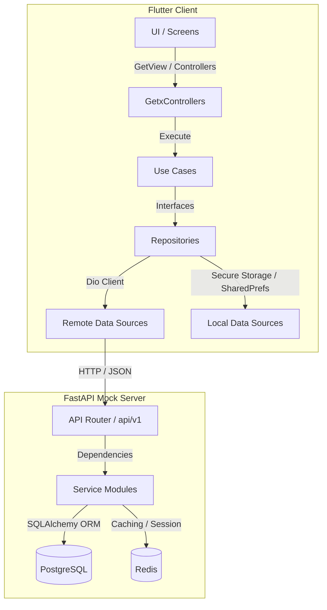

# 🚀 Trackyond

Trackyond is a modern, high-performance work, attendance, and job management platform. The repository contains a complete ecosystem comprising a client application (Flutter) and a mock backend server (FastAPI).

---

## 🏗️ System Architecture

Trackyond is built using a decoupled client-server architecture:



---

## 📱 Client (Flutter)

The mobile client is designed following a modified **Clean Architecture** combined with GetX for state management and routing.

### Key Features
- **Authentication**: Phone OTP verification with rate limits and cooldown tracking.
- **Roles**: Distinct workflows for **Employers/Owners** and **Employees/Workers**.
- **Attendance Management**: Worker check-in/check-out with geographic tracking.
- **Job Management**: Creation, details page, and progress updates.
- **Job Chat**: Rich media chat (image/video/document sharing) within specific job rooms.
- **Custom Camera**: Media capture capability (photos & trimmed video support).
- **Notifications**: System-wide notifications with inline details page.

### Tech Stack & Libraries
- **State Management & Routing**: [GetX](https://pub.dev/packages/get)
- **Networking**: [Dio](https://pub.dev/packages/dio) with custom interceptors for token refreshing and device metadata.
- **Functional Programming**: [fpdart](https://pub.dev/packages/fpdart) (using `Either` for clean error/success handling).
- **Code Generation**: [Freezed](https://pub.dev/packages/freezed) and [json_serializable](https://pub.dev/packages/json_serializable).
- **UI & Experience**: Google Fonts, Pinput, Extended Image, Shimmer skeleton placeholders, and custom animations.
- **Device Utilities**: Geolocation, Connectivity Plus, Device Info Plus, Package Info Plus.

### Project Directory Structure
All client code is located in the `/lib` directory:
- [lib/app](file:///D:/Vxplore%20Projects/trackyond/lib/app): App-wide configurations, routing declarations, and initial bindings.
- [lib/core](file:///D:/Vxplore%20Projects/trackyond/lib/core): Shared layers including common UI widgets, theme tokens, constants, custom utilities, and network configurations.
- [lib/features](file:///D:/Vxplore%20Projects/trackyond/lib/features): Feature-driven modules (e.g., `auth`, `owner`, `worker`, `camera`, `job_chat`, `notification`). Each module is structured into `data`, `domain`, and `presentation` directories.

---

## ⚙️ Server (FastAPI Mock API)

Located in the [trackyond-mock-api](file:///D:/Vxplore%20Projects/trackyond/trackyond-mock-api) directory, this mock server hosts the database models, REST APIs, and background processes to facilitate integration and mock tests.

### Key Features
- **Routing**: Folder-based nested routing separated under `api/v1/admin/` (for Employers) and `api/v1/` (for Employees).
- **Fat Services & Thin Routers**: Routers handle HTTP logic and dependency injection; services encapsulate business logic and database queries.
- **Database Migrations**: Managed via Alembic.
- **Dockerized Environment**: Quick multi-container orchestration.

### Tech Stack
- **Framework**: FastAPI (uvicorn)
- **Database**: PostgreSQL (using SQLAlchemy)
- **Cache**: Redis
- **Migrations**: Alembic
- **Auth**: PyJWT for session tokens
- **Push Services**: Firebase Admin SDK

---

## 🚦 Getting Started

### Prerequisites
- [Flutter SDK](https://docs.flutter.dev/get-started/install) (matching Dart SDK `^3.11.4`)
- [Docker](https://docs.docker.com/get-started/) & [Docker Compose](https://docs.docker.com/compose/)
- Python 3.10+ (if running the backend locally without Docker)

---

### Running the Backend Mock Server

To launch the database, Redis cache, and the mock API, navigate to the mock API folder and use Docker Compose:

```bash
cd trackyond-mock-api
docker-compose up -d --build
```

#### Seed Mock Data
To populate the database with seed/test data:
```bash
docker-compose exec trackyond-api python seed_mock.py
```

For more API reference:
- Employer endpoints: See [api_admin.md](file:///D:/Vxplore%20Projects/trackyond/api_admin.md)
- Employee endpoints: See [api_employee.md](file:///D:/Vxplore%20Projects/trackyond/api_employee.md)
- Message payloads: See [message_payload_examples.md](file:///D:/Vxplore%20Projects/trackyond/message_payload_examples.md)

---

### Running the Flutter Client

1. **Get Dependencies**:
   ```bash
   flutter pub get
   ```

2. **Generate Code Contracts (Freezed/JSON)**:
   ```bash
   flutter pub run build_runner build --delete-conflicting-outputs
   ```

3. **Launch Project**:
   ```bash
   flutter run
   ```

---

## 📐 Guidelines & Rules

All code contributions must strictly follow the specifications laid out in the project's guide:
- Refer to [GEMINI.md](file:///D:/Vxplore%20Projects/trackyond/GEMINI.md) for naming guidelines, UI standards (Shimmer skeleton wrapper rules), base class templates, API response schemas, and import rules.
- Review dependencies and environment versions in [pubspec.yaml](file:///D:/Vxplore%20Projects/trackyond/pubspec.yaml).
- Maintain camelCase naming conventions for API interfaces and JSON entities.
